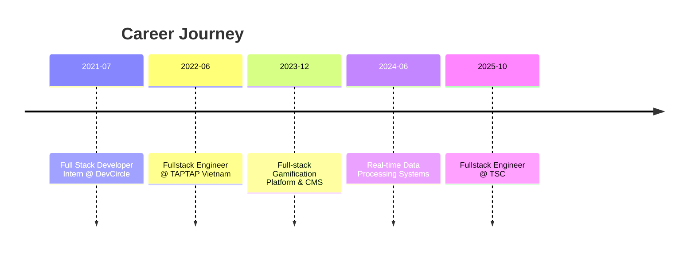

# Hi, I'm Nguyen Cong Phi 👋

**Fullstack Engineer (4+ years)** building scalable products with strong focus on system design, performance, and clean developer experience.

---

## About me

- 📍 Ho Chi Minh City, Vietnam
- 💼 Currently: **Fullstack Engineer @ TSC**
- 🧠 Strong in: **React / Next.js / TypeScript / Node.js / NestJS**
- ⚙️ Interested in: **AI-assisted engineering, real-time analytics, scalable architecture**
- 🌍 English: **TOEIC 875**

I enjoy turning complex business workflows into products that are simple to use, fast, and maintainable.

### Impact snapshot

---

## Tech stack

  

### Frontend
`React` · `Next.js` · `TypeScript` · `JavaScript` · `Redux Toolkit` · `RTK Query` · `D3.js`

### Backend
`Node.js` · `NestJS` · `Laravel APIs` · `REST` · `GraphQL` · `Prisma`

### Databases & Data
`PostgreSQL` · `MongoDB` · `Redis` · `Kafka` · `Real-time Processing`

### DevOps & Engineering
`Docker` · `CI/CD` · `AWS` · `GCP` · `Jenkins` · `Testing (Jest, Unit/Integration)`

---

## Experience highlights

### Fullstack Engineer — TSC (Oct 2025 → Present)
- Built and maintained SaaS applications using React, TypeScript, Redux Toolkit, RTK Query, and Laravel-based APIs.
- Improved maintainability through JavaScript → TypeScript migrations and reusable component architecture.
- Applied AI tools (Copilot, Cursor, LLM workflows) for planning, code review, refactoring, and test generation.

### Fullstack Engineer — TAPTAP Vietnam (Jun 2022 → Oct 2025)
- Developed enterprise platforms for gamification, CMS, and segmentation analytics.
- Delivered solutions serving up to **3M+ users** with real-time and large-scale data processing.
- Improved data freshness from **T-1 day to T-1 hour** in backend pipelines.
- Collaborated across product, design, data, and engineering to ship high-impact features.

### Career timeline

---

## Education

**B.Eng. in Software Engineering**  
University of Information Technology, Vietnam National University HCMC  
GPA: **8.79/10** · Ranked **#1** in graduation cohort

---

## Certifications & awards

- HackerRank — Problem Solving (Intermediate)
- freeCodeCamp — JavaScript Algorithms and Data Structures
- CodeTour x Uni 2020 — Finalist

---

## Competitive programming & profiles

- [HackerRank](https://www.hackerrank.com/nguyencongphi)
- [LeetCode](https://leetcode.com/UIT19522006/)
- [CodeLearn](https://codelearn.io/profile/202408)

---

## GitHub stats

  
  

  

  

  

---

## Let's connect

- LinkedIn: [linkedin.com/in/phicn312](https://www.linkedin.com/in/phicn312)
- Email: [congphinguyen312@gmail.com](mailto:congphinguyen312@gmail.com)
- GitHub: [github.com/CongPhiNguyen](https://github.com/CongPhiNguyen)
